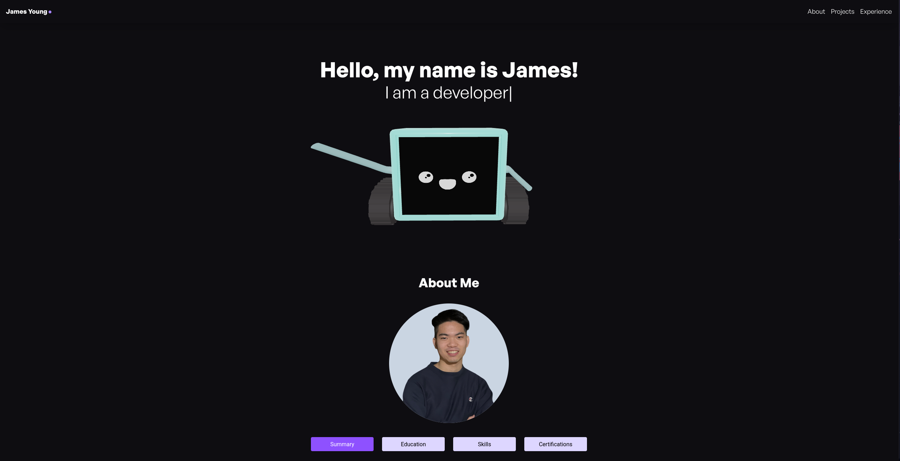

# Portfolio Website

My portfolio website [jyyoung.com](https://jyyoung.com). Written in React, TailwindCSS, and ThreeJS. 3D model created and animated with Blender. Hosted on AWS, deployed with Terraform.

## Preview

## Build

Clone repo, `npm run build`, `npx serve -s dist`.

To deploy with S3, use Terraform, sync to S3 static bucket, eg. `aws s3 sync ./dist s3://jyyoung.com --delete --profile Prod`
